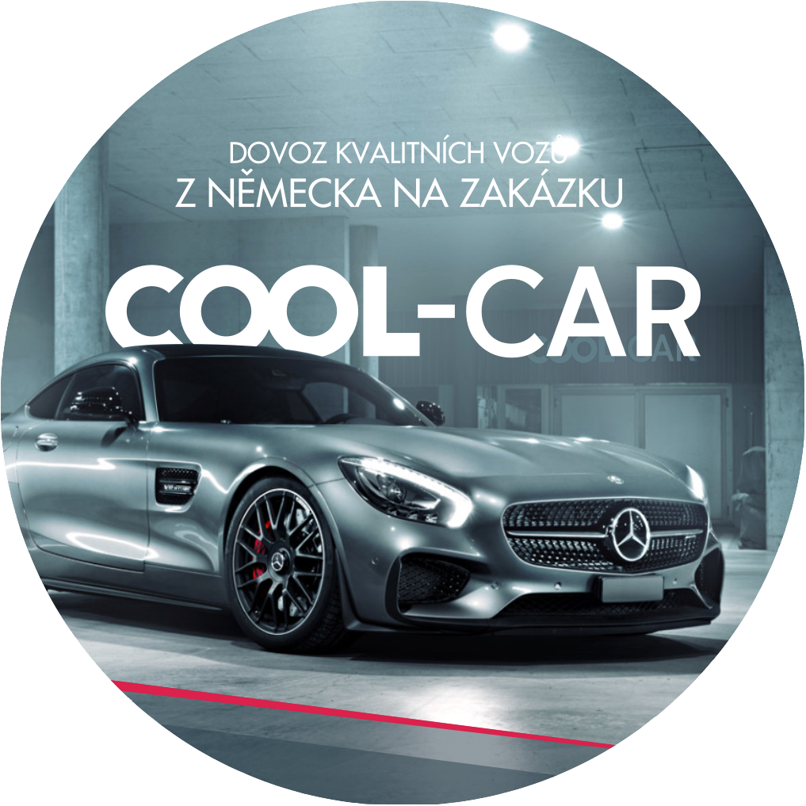

# 🚗 COOL-CAR Website

<div align="center">
  


**🌟 Vaše cesta k tomu správnému vozu. Bez vyjímek. 🌟**

[](https://godblessamki.github.io/CoolCarWebsite/)
[](https://developer.mozilla.org/en-US/docs/Web/HTML)
[](https://developer.mozilla.org/en-US/docs/Web/CSS)
[](https://developer.mozilla.org/en-US/docs/Web/JavaScript)

</div>

---

## 🎯 O Projektu

**Cool-Car** je moderní webová stránka pro specializovanou autosalón v České republice, která se zaměřuje na **dovoz vozidel** a **prodej ověřených vozů**. Stránka kombinuje futuristický neonový design s profesionálními službami v oblasti automobilového průmyslu.

### ✨ Klíčové Vlastnosti

- 🌈 **Neonový cyberpunk design** s animovanými efekty
- 📱 **Responzivní layout** pro všechna zařízení
- 🚀 **Moderní CSS animace** a hover efekty
- 🗺️ **Interaktivní Google Maps** integrace
- 📧 **Kontaktní formulář** pro zákazníky
- ⚡ **Rychlé načítání** a optimalizovaný výkon

---

## 🎨 Design & Témata

### Barevná Paleta
```css
🟦 Neon Blue:   #00f0ff
🟥 Neon Red:    #ff004f  
🟪 Neon Purple: #9a00ff
⚫ Dark BG:     #0a0a0a
⚪ White Text:  #ffffff
```

### Typografie
- **Hlavní písmo**: Gallos Uncial (custom font)
- **Tělo textu**: Arial, sans-serif
- **Efekty**: Neonové text-shadow animace

---

## 🏢 Naše Služby

### 🚛 Dovoz Vozidel
- Import aut z celého světa
- Vyřízení veškeré administrativy
- Řešení cel a daní
- Kompletní logistika

### 🏆 Prodej Ověřených Vozů
- Exkluzivní výběr místních a importovaných vozidel
- Všechna vozidla prošla kontrolou
- Transparentní ceny
- Garance kvality

---

## 📂 Struktura Projektu

```
CoolCarWebsite/
├── 📄 index.html          # Hlavní stránka
├── 📄 about.html          # O nás
├── 📄 contact.html        # Kontakt + mapa
├── 📄 import.html         # Dovoz vozidel (ve vývoji)
├── 📄 sales.html          # Prodej vozů (ve vývoji)
├── 🎨 style.css           # Hlavní styly
├── ⚡ script.js           # JavaScript funkcionalita
├── 📁 images/             # Obrázky a loga
│   ├── logo.png
│   └── hero-bg.png
├── 📁 fonts/              # Custom fonty
│   └── GallosUncial.ttf
└── 📋 README.md           # Tento soubor
```

---

## 🚀 Instalace & Spuštění

### Požadavky
- Moderní webový prohlížeč (Chrome, Firefox, Safari, Edge)
- Webový server (pro lokální vývoj)

### Rychlé Spuštění

1. **Klonování repozitáře**
```bash
git clone https://github.com/godblessamki/CoolCarWebsite.git
cd CoolCarWebsite
```

2. **Spuštění lokálního serveru**
```bash
# Použití Python
python -m http.server 8000

# Nebo Node.js
npx http-server

# Nebo Live Server v VS Code
# Klikněte pravým na index.html → "Open with Live Server"
```

3. **Otevření v prohlížeči**
```
http://localhost:8000
```

---

## 🛠️ Technologie

| Technologie | Použití | Verze |
|-------------|---------|--------|
| **HTML5** | Struktura stránky | Latest |
| **CSS3** | Styling & animace | Latest |
| **JavaScript** | Interaktivita | ES6+ |
| **Google Fonts** | Webové fonty | - |
| **Google Maps API** | Mapa v kontaktu | v3 |

---

## 📱 Responzivní Design

Stránka je optimalizována pro všechna zařízení:

- 📺 **Desktop**: Full experience s animacemi
- 💻 **Tablet**: Adaptivní layout
- 📱 **Mobile**: Hamburger menu, touch-friendly

### Breakpoints
```css
📱 Mobile:  < 768px
💻 Tablet:  768px - 1024px  
📺 Desktop: > 1024px
```

---

## 🌟 Speciální Funkce

### Neonové Animace
- Pulsující efekty na tlačítkách
- Glow efekty na textu
- Hover animace na kartách
- Smooth scrolling

### Interaktivní Prvky
- Responsive hamburger menu
- Kontaktní formulář s validací
- Google Maps integrace
- Smooth page transitions

---

## 📍 Kontakt

<div align="center">

**🏢 COOL-CAR**  
📍 Dlouhá 920, 763 21 Slavičín  
📧 coolcar@email.cz  
📞 +420 775 087 087  

[🌐 Navštívit web](https://godblessamki.github.io/CoolCarWebsite/) | [📧 Kontakt](mailto:coolcar@email.cz) | [📱 Zavolat](tel:+420775087087)

</div>

---

## 👨‍💻 Autor

**Samuel Kouřil**  
*Web Developer & Designer*

---

## 📄 Licence

© 2025 Cool-Car. Všechna práva vyhrazena.

---

<div align="center">

**⭐ Pokud se vám projekt líbí, dejte mu hvězdičku! ⭐**

*Vytvořeno s ❤️ pro milovníky aut a kvalitního webu*

</div>